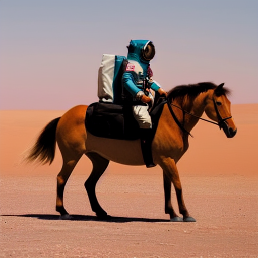
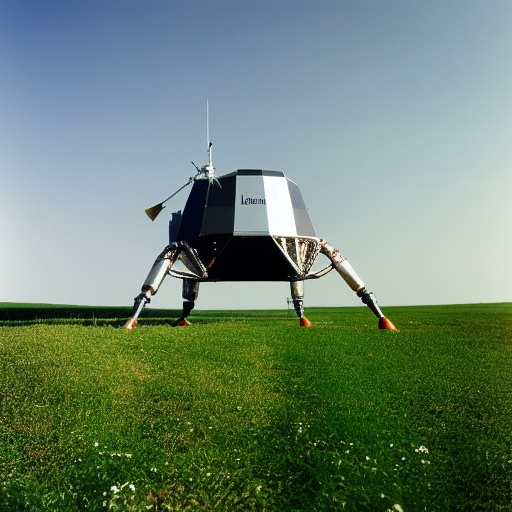
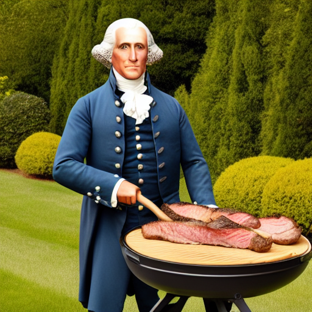

# SD4J (Stable Diffusion in Java)

This repo contains an implementation of Stable Diffusion inference running on top of ONNX Runtime,
written in Java. It's a modified port of the [C# implementation](https://github.com/cassiebreviu/StableDiffusion/),
with a GUI for repeated generations and support for negative text inputs. It is intended to be a
demonstration of how to use ONNX Runtime from Java, and best practices for ONNX Runtime to get good performance.
We will keep it current with the latest releases of ONNX Runtime, with appropriate updates as new performance
related ONNX Runtime features become available through the ONNX Runtime Java API. All the code is subject to change as
this is a code sample, any APIs in it should not be considered stable.

This repo targets ONNX Runtime 1.20. The version number is in two parts `<sd4j-version>-<onnxruntime-version>`, and the
initial release of sd4j is v1.0-1.14.0. We'll bump the sd4j version number if it gains new features and the ONNX Runtime
version number as we depend on newer versions of ONNX Runtime.

The project supports txt2img generation, it doesn't currently implement img2img, upscaling or inpainting.

By default it uses a fp32 model, and running on a 6 core 2019 16" Intel Macbook Pro each diffusion step takes around 5s. 
Running on better hardware, or with a CUDA GPU will greatly reduce the time taken to generate an image, as will using an
SD-Turbo model. There is experimental support for the CoreML (for macOS) and DirectML (for Windows) backends, but at the
moment CoreML does not accelerate computation due to a lack of support for all the UNet operations in ONNX Runtime's 
CoreML backend.

## Example images

These are a few example images generated by this code along with their generation parameters:



Text: "Wildlife photograph of an astronaut riding a horse in the desert", Negative Text: "", Seed: 42, Guidance Scale: 10, Inference Steps: 40, Scheduler: Euler Ancestral, Image Size: 512x512.


Text: "Press photo of an America's Cup catamaran sailing through the sands of Mars, high resolution, high quality", Negative Text: "water, sea, ocean, lake", Seed: 42, Guidance Scale: 10, Inference Steps: 40, Scheduler: Euler Ancestral, Image Size: 512x512.



Text: "Professional photograph of the Apollo 11 lunar lander in a field, high quality, 4k", Negative Text: "", Seed: 42, Guidance Scale: 10, Inference Steps: 50, Scheduler: Euler Ancestral, Image Size: 512x512.



Text: "Professional photograph of George Washington in his garden grilling steaks, detailed face, high quality, 4k", Negative Text: "painting, drawing, art", Seed: 42, Guidance Scale: 10, Inference Steps: 60, Scheduler: Euler Ancestral, Image Size: 512x512.

## Model support

The SD4J project supports SD v1.5, SD v2 and SDXL style models. For models which do not support classifier-free guidance
or negative prompts, such as SD-Turbo or SDXL-Turbo, the guidance scale should be set to a value less than 1.0 which
disables that guidance. Models like SD-Turbo can generate acceptable images in as few as two diffusion steps. The 
difference between SDv1 and SDv2 models is autodetected, but `SDXL` must be supplied as the model type for SDXL models
otherwise it will throw an exception on generation. In some cases the autodetection of v1 and v2 may fail in which case
supplying the `--model-type {SD1.5, SD2, SDXL}` argument with the appropriate parameter will fix the model type.

## Installation

This project requires [Apache Maven](https://maven.apache.org), [Java 17 or newer](https://www.oracle.com/java/technologies/downloads/), and a Stable Diffusion model checkpoint.
The other dependencies (ONNX Runtime, ONNX Runtime extensions and Apache Commons Math) are downloaded by Maven 
automatically.

### Prepare model checkpoint

There are many compatible models on [Hugging Face's website](https://huggingface.co). We have tested several Stable Diffusion variants.
The [Stable Diffusion v2.1 checkpoint](https://huggingface.co/stabilityai/stable-diffusion-2-1) is available under the [OpenRAIL++-M license](https://huggingface.co/stabilityai/stable-diffusion-2/blob/main/LICENSE-MODEL), and can be exported
to ONNX format using Hugging Face's [diffusers library](https:://github.com/huggingface/diffusers) supplying `stabilityai/stable-diffusion-2-1` as the model path.
For other SD models there is a one or two stage process to generate the ONNX format models. If the model is already in 
Hugging Face Diffusers format then you can run the `convert_stable_diffusion_checkpoint_to_onnx.py` file from the 
[diffusers](https://github.com/huggingface/diffusers) project as follows:
```bash
python scripts/convert_stable_diffusion_checkpoint_to_onnx.py --model_path <path-on-disk-or-model-hub-name> --output_path <path-to-onnx-model-folder>
```
If the model is an original stable diffusion checkpoint then you first need to run:
```bash
python scripts/convert_original_stable_diffusion_to_diffusers.py --checkpoint_path <path-on-disk-to-checkpoint> --scheduler_type lms --dump_path <path-on-disk-to-diffusers-output>
```
If the model is an SDXL model then it needs to be exported from the Hugging Face Hub 
using [optimum](https://github.com/huggingface/optimum):
```bash
optimum-cli export onnx --model <model-hub-name> <path-to-onnx-model-folder>
```
The scripts require a suitable Python 3 virtual environment with `diffusers`, `onnxruntime`, `optimum` and `onnx` 
installed.

## Running the GUI

The GUI can be executed with `mvn package exec:exec -DmodelPath=<path-to-stable-diffusion-model>`. It constructs a
window where you can specify the parameters of the image you'd like to generate, and each image creates its own window
where it can save the image as a png file. Saved png files contain a metadata field with the generation parameters.

### Use in other programs

The `com.oracle.labs.mlrg.sd4j.SD4J` class provides a full image generation pipeline which can be used without the GUI
directly from other code.

### Using a CUDA GPU

To use the GPU you need to modify the pom file to depend on `onnxruntime_gpu` and swap `<argument>CPU</argument>` for
`<argument>CUDA</argument>` in the `exec-maven-plugin` block.

## Implementation details

This code provides a thin `Tensor` wrapper object which is a tuple of a direct `ByteBuffer` instance and a long shape
array, which is used to provide easy access in and out of ORT's `OnnxTensor` objects. There's a `Scheduler` interface 
which the two available schedulers (LMS and Euler Ancestral) implement. The `SD4J` pipeline object is a suitable entry
point for use without the GUI, and there is an example of such usage in the `CLIApp` class.

## Contributing

This project welcomes contributions from the community. Before submitting a pull request, please [review our contribution guide](./CONTRIBUTING.md).

## Security

Please consult the [security guide](./SECURITY.md) for our responsible security vulnerability disclosure process

## License

The code is available under the [Universal Permissive License (UPL)](https://oss.oracle.com/licenses/upl/). It requires
a Stable Diffusion model architecture checkpoint to work, and any Stable Diffusion models should be used under their
licenses. There are 1000+ compatible models available
on [Hugging Face](https://huggingface.co/models?other=stable-diffusion) each of which are licensed separately, though many use a variant of
the [OpenRAIL-M license](https://github.com/CompVis/stable-diffusion/blob/main/LICENSE).

The [tokenizer onnx model](text_tokenizer/custom_op_cliptok.onnx) is taken from the 
[C# implementation](https://github.com/cassiebreviu/StableDiffusion/), and is available under the MIT license. More 
details on the tokenizer are available in its [README file](text_tokenizer/README.md).
